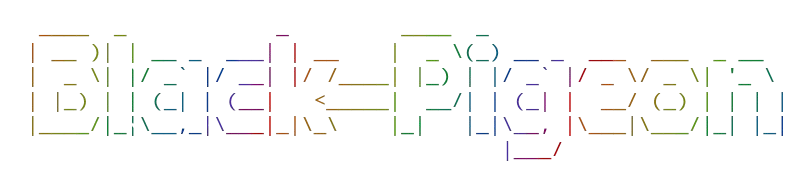

<p align="center">

</p>

# 📋 About __*Black Pigeon*__

__*Black Pigeon*__ is a simple Python tool , responsible for hiding various types of data into __PNG__ or __JPEG__ after the EOI marker of the image file to ensure security and privacy.

__It is a educational project to understand how EOI steganography works under the hood. For more robust security use LSB steganography. We are currently trying to implement more steganographic methods besides EOI__.

# ❓Why this script?

__Black Pigeon__ is my first ever github repository as well as a scripted journey to the world of cybersecurity without a formal degree in CS. As a high-school student(when I developed the script first) , I tried to document my journey. In a 4GB of RAM old laptop, I entered to the beautiful world of coding and it was my first public project in GitHub.

I know , it seems that  __Black Pigeon__ did not entirely follow industry standard best practices but eventually it is my personal project for learning. I hope one day __Black Pigeon__ will be the gold standard and go to choice for  security through obscurity with our community collaboration.

__Any good advice , guideline and collaboration will be accepted to improve or extend the project.__

# 🤝 How to contribute?
If you want to contribute to _Black Pigeon_ to improve it or add new features for enterprise grade security, please check the __issues__ tab and begin to work with your choice. For personal inquiries and collaboration feel free to reach out via [Email](mailto:"mdshadiqulislam2007@gmail.com") as I am not currently active in social-media.

# ⚙️ How does it work?

To hide file(s)  inside the given image, it typically compresses files to be hidden using popular LZMA algorithm to reduce size and create a temporary zip file. Besides it uses cryptographic algorithm to encrypt data during compression process.A popular symmetric cryptographic algorithm called __Fernet__ is used along with a password protection mechanism for users. Then the ZIP file is appended after the EOI(End Of the Image) marker of the given image.

### EOI marker for images:
- JPEG/JPG `FFD9`(HEX)
- PNG `49454E44AE426082`(HEX)

# 🤔 Why does it work?
Modern image parsers don't read image files after the specific EOI marker. Therefore appending any information after EOI marker is a safer choice for hiding information.

### Advantages of EOI steganography
- Huge information can be obscured
- It does not affect image quality
- Ommited by modern image parsers

### Disadvantages of EOI steganography 
- Social media platforms often exclude contents after EOI marker for security reason
- It is insecure compare to modern steganographic methods like __LSB__ steganography 
- It is easy to idenify

Make sure __Python3__ is installed on your system to use this tool.

# 🛠️ Dependencies
This script was mostly developed using python standard library. Which come in-built with python. Besides some popular third-party libraries are used.

- `cryptography`(Third-party)
- `zipfile`
- `hashlib`
- `base64`
- `os`
- `sys`
- `subprocess`
- `time`


# 📒 Supported Files
1. PNG (.png)
2. JPEG (.jpeg)
3. ZIP (.zip)

# 💡Features
- Compression
- Decompression
- Encryption
- Decryption
- Steganographic obscuration
- File Injection
- File extration
- Password Protection

# 🔧Installation

### Step 1 :
```sh
git clone https://github.com/xenon-computing/black_pigeon.git
```

### Step 2 :
```sh
cd black_pigeon
```

### Step 3 :
For Windows :
```sh
pip install -r requirements.txt
```

For Linux/MacOS:
```sh
pip3 install -r requirements.txt
```
For Termux:
```sh
pkg install python-cryptography
```
If you are using termux and try to get rid of heavy rust backend for `cryptography` module , use above command to install the module.

### Step 4 (Optional) :
For Linux / Termux:
```sh
chmod +x main.py
```

# 📖 Usage
1. Aggregate all files to be obscured in a clean and separate directory.
2. Select a __*cover image*__ file```(.png or .jpeg)``` and copy the path of that image. This image is the carrier of all hidden file(s)
3. Copy the path of the directory.
4. run ```main.py ``` and select an option mentioned on the menu in the console as your need.
5. To obscure the directory, select option 1 . Then enter necessary information required by the script and don't forget to set a password for better security .
6. For extracting contents from an image where you have obscured info through __Black Pigeon__ , Select correct option from the menu and enter the password key that you set earlier during the encryption process.
7. provide an output path to save extracted information.


# 🚫 Warnings
- All types of path mentioned earlier have to be absolute, not relative
- Don't try to hide larger file(s), if your system doesn't have enough RAM, as currently we are using RAM to load and process file(s) for obscuration.
- Use the tool at your own risk in an isolated environment.

